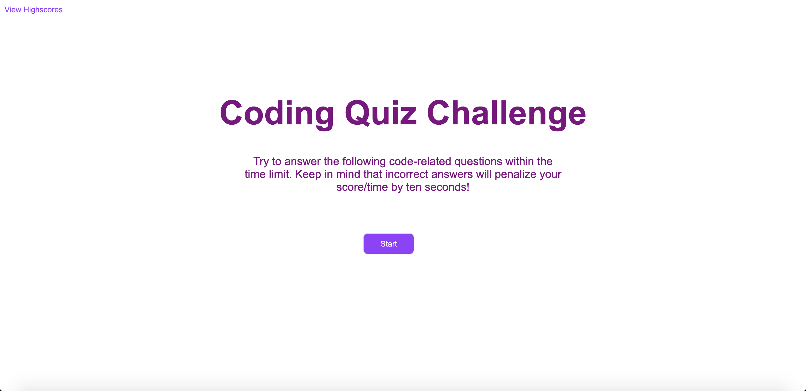
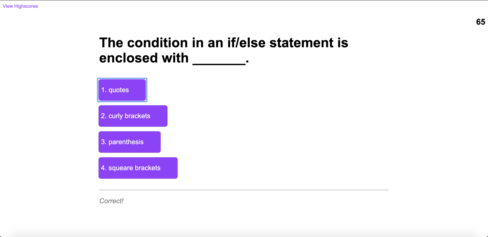
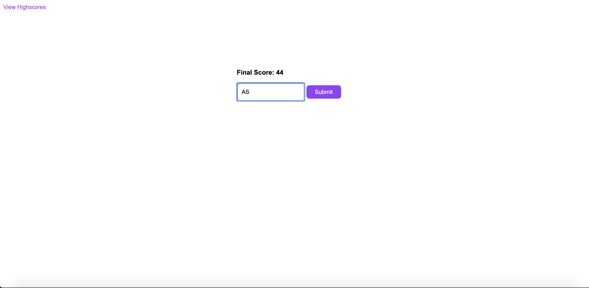
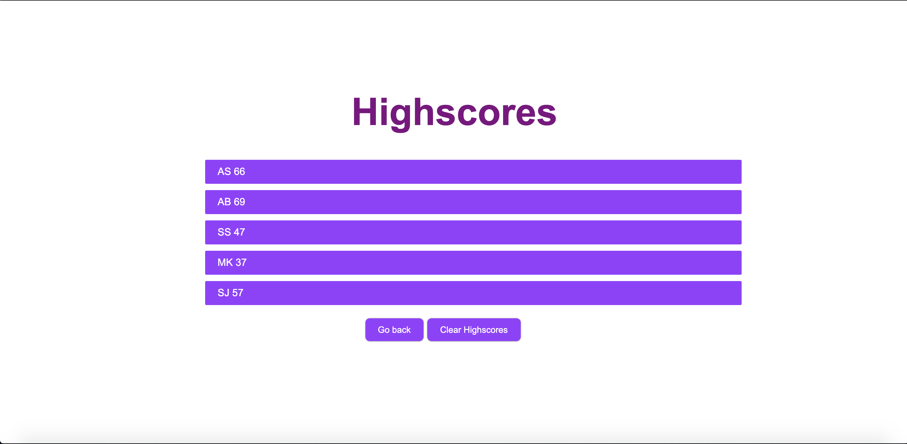

# Project Description
The goal of this project is to use javascript to interact with the user so that they can take a quiz about various coding questions. The quiz gives a score based on the time taken, and questions gotten wrong. There is another page that retains all the highscores of people who have taken the quiz that is viewed after completing the quiz. 

# What the Website Looks Like
The first image is the welcome page that gives the instructions for the quiz. The second image is what the site looks like once the user starts taking the quiz. The third image is what the screen looks like when entering their initials. The fourth image is what the site looks like once they are finished and viewing the highscore page.

# Link to Deployed Application
Link: https://anishasnet.github.io/coding-quiz/